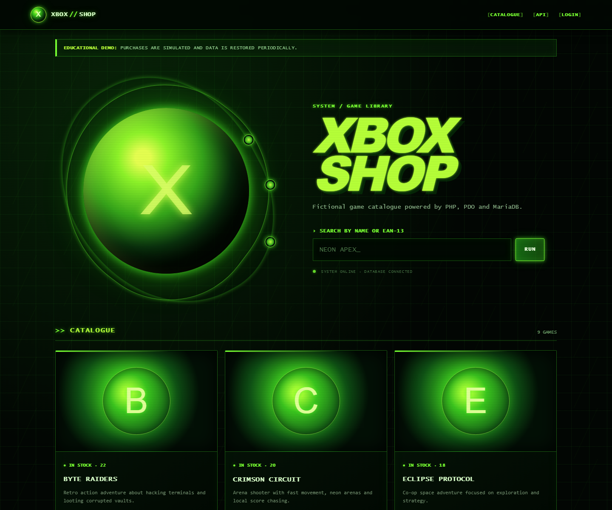

# Xbox Shop · PHP + MariaDB

Fictional video game shop built as a portfolio project after finishing DAW. The goal is not to mimic a real e-commerce platform, but to clearly show **PHP 8**, **PDO**, **MariaDB**, web security basics and responsive frontend work without frameworks.

> **Unofficial educational fan project.** This project is not affiliated with, endorsed by, or sponsored by Microsoft or Xbox. All catalogue products and names are fictional.

[Live demo](https://pierrelaguerre.alwaysdata.net/catalogo)



## What it demonstrates

- Responsive catalogue with search by name or EAN-13.
- Demo purchase flow with row locking, stock updates and sale records inside a transaction.
- Product CRUD protected by session-based authentication.
- Prepared statements, server-side validation, escaped output and CSRF tokens.
- JSON catalogue API and EAN-13 lookup.
- Scheduled reset for demo data.
- Unit and MariaDB integration tests running in GitHub Actions.

## Architecture

```text
public/       Front controller and public web assets
src/          Configuration, HTTP layer, repositories, services and validators
templates/    PHP views and shared layout
database/     Reproducible schema and fictional seed data
bin/          Admin creation, linting and demo reset scripts
tests/        Unit and integration tests
```

The main flow is `Application → Service → Repository → PDO`. It is intentionally small so every decision is easy to explain, inspect and test.

## Local installation with XAMPP/phpMyAdmin

Requirements: PHP 8.2 or newer, Composer, MariaDB/MySQL and the `pdo_mysql` and `mbstring` extensions.

1. Clone the repository inside `htdocs` and enter the project folder.
2. Install dependencies:

   ```bash
   composer install
   ```

3. Copy `.env.example` to `.env` and configure the local URL and database credentials. Do not reuse the example password.
4. In phpMyAdmin, create a database named `xbox_shop` with `utf8mb4_unicode_ci` collation and import, in this order, `database/schema.sql` and `database/seed.sql`. With XAMPP you can also automate this step with `php bin/setup-local.php`; use `ROOT_DB_USER`/`ROOT_DB_PASS` if your root account does not use the default setup.
5. To enable the admin area, temporarily add a password of at least 12 characters to `.env`:

   ```dotenv
   ADMIN_PASSWORD=a-secure-local-password
   ```

   Then run `php bin/create-admin.php admin` and remove that line from `.env`.
6. Open `http://localhost/xbox-shop/public/`.

Apache needs `mod_rewrite` enabled. For development, you can also run:

```bash
php -S 127.0.0.1:8080 -t public public/router.php
```

and set `APP_URL=http://127.0.0.1:8080`.

## Environment variables

| Variable | Purpose |
|---|---|
| `APP_URL` | Public URL without trailing slash |
| `APP_DEBUG` | Shows detailed errors only in local development |
| `SESSION_SECURE` | Must be `true` under HTTPS |
| `DEMO_MODE` | Enables purchase limits and allows demo reset |
| `DEMO_PURCHASE_LIMIT` | Maximum purchases per session and hour |
| `DB_*` | Private MariaDB/MySQL connection settings |

`.env` and `vendor/` are excluded from Git. The repository only contains `.env.example`, the schema and fictional seed data.

## API

- `GET /api/productos`: catalogue with stock; accepts `?q=text`.
- `GET /api/productos/ean?ean13=5901234123457`: one product or a JSON error with `404`/`422` status.

## Quality

```bash
composer lint
composer test
```

Integration tests are skipped locally unless `TEST_DB_*` variables exist. In CI, GitHub Actions creates a disposable MariaDB service and covers successful purchases, insufficient stock, missing products and rollback behaviour.

Before publishing a release, the manual checklist also covers catalogue browsing, search, purchase flow, login/logout, CRUD, API responses, mobile viewport, keyboard navigation, contrast and Lighthouse.

## Free deployment on Alwaysdata

1. Create a Free account, a MariaDB database and a database user.
2. Clone the repository through SSH and run `composer install --no-dev --optimize-autoloader`.
3. Import `database/schema.sql` and `database/seed.sql` from the panel or console.
4. Create `.env` in the private project root with the Alwaysdata credentials. Use `SESSION_SECURE=true`, `APP_DEBUG=false` and the URL `https://username.alwaysdata.net`.
5. Configure the site as PHP and point its document root to `public/`.
6. Create the administrator with `bin/create-admin.php` and remove `ADMIN_PASSWORD`.
7. Schedule a daily task: `php /path/to/project/bin/reset-demo.php`.
8. Verify HTTPS, purchase flow, login and API before linking the demo.

Reference documentation: [plans](https://www.alwaysdata.com/en/pricing/), [PHP](https://help.alwaysdata.com/en/web-hosting/languages/php/) and [MariaDB](https://help.alwaysdata.com/en/web-hosting/databases/mariadb/).

## GitHub presentation

When publishing, use this repository description: `Educational PHP 8, PDO, MariaDB and responsive frontend shop.` Add the demo URL and the topics `php`, `mysql`, `pdo`, `html`, `css`, `javascript` and `portfolio`.

Include screenshots of the desktop/mobile catalogue and the admin panel without credentials. Then pin the repository from **Customize your pins** on your GitHub profile.

## Decisions and learnings

- PDO and prepared statements keep data separate from SQL queries.
- `SELECT … FOR UPDATE` prevents two purchases from consuming the same stock at the same time.
- The POST/Redirect/GET pattern prevents accidental duplicate submissions on refresh.
- EAN codes are handled as text so leading zeroes are preserved.
- The administrator is created outside the versioned SQL files; no password reaches the repository.
- The frontend uses native HTML, CSS and JavaScript to keep the fundamentals visible.

## License

Code released under [MIT](LICENSE). This license does not grant any rights over third-party trademarks.
